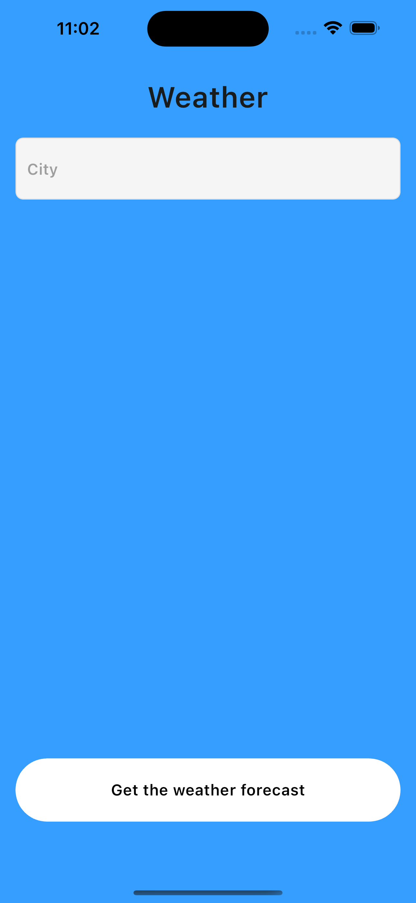
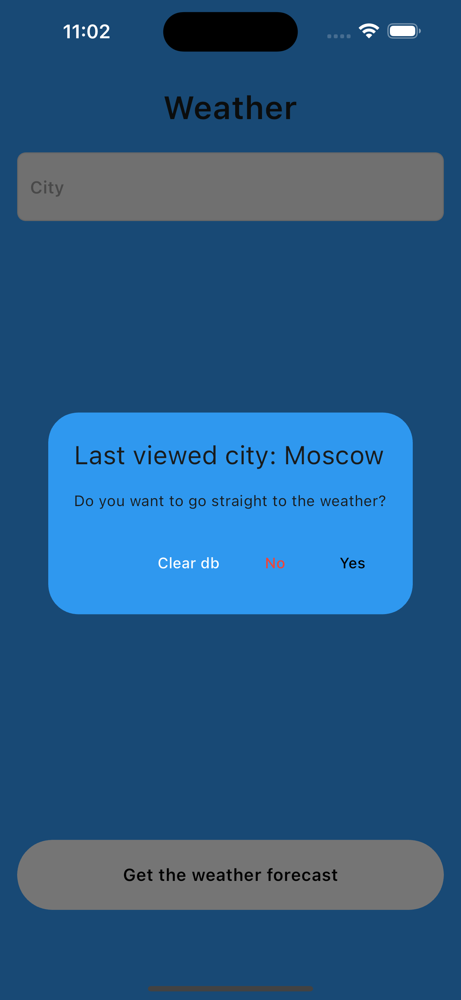
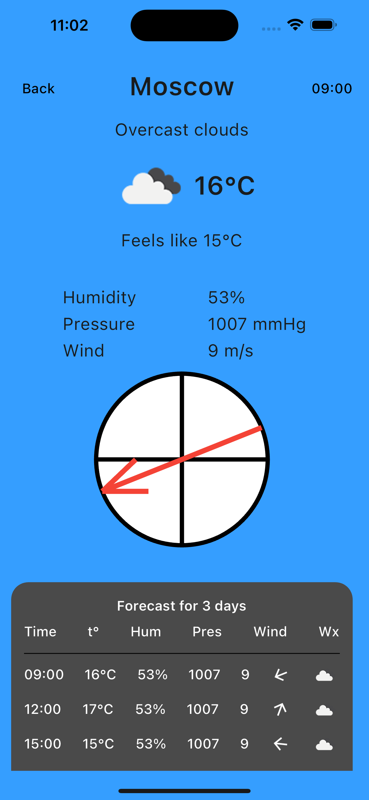
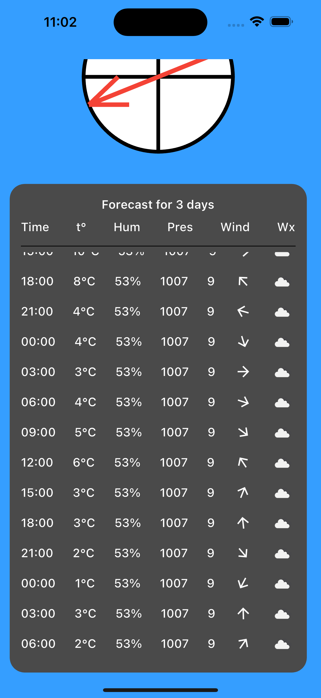
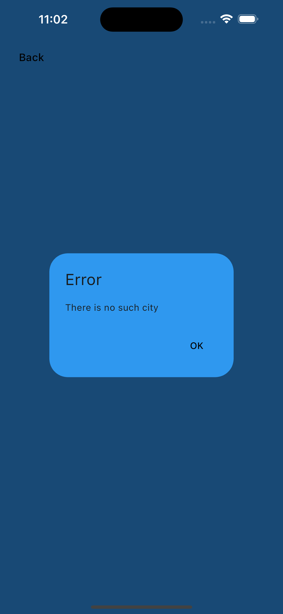

# weather-app

# Приложение, выполненное в качестве тестового задания
По публичному API погоды: https://openweathermap.org/api/hourly-forecast#name5  

### Особености приложения:
1. Используется кеширование (Hive) для запоминания городов
2. На главном экране элемент направления ветра выполнен с помощью CustomPaint
3. Обработка ошибок при неправильном вводе города (показывается кастомный экран с ошибкой)
4. По тестовому заданию необходимо было расписывать время, затраченное на задание (приведено ниже)

## Скриншоты приложения:

  
  

  
  

  

## Time
Четверг
09:15 Создание репозитория
09:30 Создание каркаса дизайна
10:30 Создание каркаса второго экрана
10:50 Перерыв
12:00 Начало парсинга JSON
13:00 Перерыв
14:30 Парсинг JSON
15:00 Добавление провайдера, разделение на слои
16:00 Навигация, наполнение второго экрана
16:30 Перерыв, уточнение дизайна 
18:00 Создание компаса направления ветра

Пятница
8:30 Замена ссылки для парсинга данных
9:30 Заполнение погоды на три дня
10:30 Перерыв
11:15 Добавление данных о направлении ветра на три дня
11:30 Изменение дизайна
11:45 Рефакторинг
12:30 Перерыв
13:30 Обработка ошибок
14:20 Валидация данных
15:00 Исправление багов
16:00 Перерыв
17:00 Добавление кеширования
18:30 Тестирование

### For codegen:
flutter packages pub run build_runner build